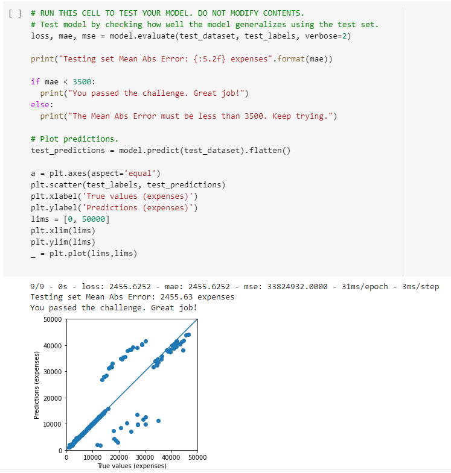

# Linear Regression Health Costs Calculator

- This machine learning project uses linear regression to try to predict health costs.

# Live Version

https://colab.research.google.com/drive/18B0X1_JJ0VVWNQxLFap3AmikDFQuoVdQ?usp=sharing

# Requirements

- You are given a dataset that contains information about different people including their healthcare costs. 
- Use the data to predict healthcare costs based on new data.
- The first two cells of this notebook import libraries and the data.
- Make sure to convert categorical data to numbers. Use 80% of the data as the train_dataset and 20% of the data as the test_dataset.
- Pop off the "expenses" column from these datasets to create new datasets called train_labels and test_labels. Use these labels when training your model.
- Create a model and train it with the train_dataset. 
- To pass the challenge, model.evaluate must return a Mean Absolute Error of under 3500. This means it predicts health care costs correctly within $3500.